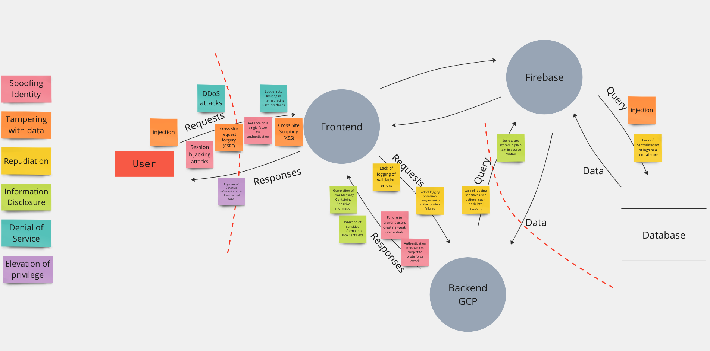

# Raisekit
## What is Raisekit?

Raisekit is a web application that aims to streamline fundraising for founders by automating the manual processes involved. Currently, Raisekit is focused on automating fundraising metrics and data rooms. Founders can upload their sales, costs and cash data to automatically calculate the most popular metrics for fundraising.

## Backend Architecture and Tech Stack

The backend of Raisekit is a NodeJS server built with Fastify. It utilizes Cloud Firestore as a database. It's containerized via Docker and deployed on a Google Cloud Run container via Cloud Build.

## Raisekit Cloud Architecture


## Raisekit CI/CD Pipeline


## Develop locally
Follow the instructions below to set up a local development environment for Raisekit.

1. Clone the repository
```
git clone https://github.com/Raisekit/raisekit-frontend.git
```
2. Copy the .env file, the docker-compose file and the service account credentials into the repository
```
cp /path/to/.env raisekit-backend && cp /path/to/serviceAccountCreds.json raisekit-backend && cp /path/to/docker-compose.yml raisekit-backend
```
3. Install the required dependencies
```
npm install
```
4. Run the application locally
```
npm run dev
```
5. Alternatively run the application with Docker (You should have [Docker installed](https://docs.docker.com/get-docker/) in this case)
```
docker compose up --build
```
## Raisekit in production
You can use Raisekit in production at https://app.raisekit.io


## Security - Threat Modeling 🛡️
### External Dependencies
| ID | Description | 
| ----------- | ----------- |
| 1 | Raisekit backend will run on [GCP](https://cloud.google.com/docs/security/infrastructure/design) which offers network security like firewalls and network segmentation, Identity and access management, DDos protection, etc. |
| 2 | Frontend and database is host on [Firebase](https://firebase.google.com/docs/rules). Firebase provides security measures such as: Authentication, App Check (verifies that requests come from the app and are made by a genuine user), Cloud Storage Security Rules that enables control over access to files. Also Realtime Database Security Rules to specify who can read, write and update data based on defined conditions. And Security Monitoring tools to detect, identify and respond to security events in the application. |
| 3 | Backend and database connect over public internet. |
| 4 | GCP use Internet Protocol Security (IPsec) protocol on Network layer, TLS protocol on Transport layer and HTTPs, SMTP, TLS on Application layer. |


Link to frontend repo: 	[Raisekit frontend](https://github.com/Raisekit/raisekit-frontend)

### Data Flow Diagram



### Cyber Security Implemented Measures
- HTML sanitization in user input login fields. Prevent XSS attacks using [DOMPurify](https://www.npmjs.com/package/dompurify) library.
- Encode user input with [he](https://www.npmjs.com/package/he) library.
- Sanitization with [xss] (https://www.npmjs.com/package/xss) library. Another sanitizer for potentially untrusted HTML.


### Next steps
